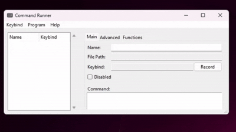
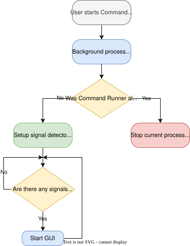
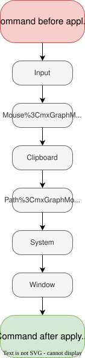
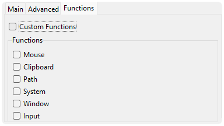
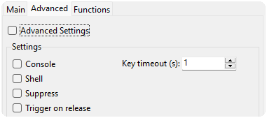

# Command Runner
   

Command Runner is a lightweight Windows automation utility that lets you bind commands, scripts, and custom actions to global hotkeys. It can interact with your clipboard, selected files, active windows, and system information, helping automate repetitive tasks and eliminate long commands you type over and over again.



# Table of Contents

- [Features](#features)
- [Why Command Runner](#why-command-runner)
- [Installation](#installation)
- [Examples](#examples)
- [Quick start](#quick-start)
- [How it works](#how-it-works)
- [Custom functions](#custom-functions)
- [Advanced settings](#advanced-settings)
- [Arguments](#arguments)
- [Development setup](#development-setup)
- [Known limitations](#known-limitations)
- [Security](#security)
- [License](#license)

# Features

- Global hotkey support
- Execute any Windows command
- Custom command variables
- Active window information
- Clipboard integration
- Selected file path access
- Mouse position tracking
- System information variables
- GUI command management
- Customizable execution settings
- Background operation

# Why Command Runner

### Developer workflow

Bind long, repetitive commands to a single hotkey. Instead of typing:
```
cd C:\Users\Name\Documents\Projects\MyProject && python -m venv .venv && .\.venv\Scripts\activate && pip install -r requirements.txt && python src\main.py
```
simply press `CTRL`+`ALT`+`R` to start working immediately.

### Easily fits into any project
Instead of remembering 10 commands for 10 different projects that use the same language, you can bind 1 command with custom functions so it will fit every project. [See](#examples)

### File automation

Create a shortcut that opens the selected file location.

### Window automation

Run commands depending on the currently focused application.

# Quick start

1. [Install Command Runner.](#installation)
2. Launch the application. If it is already running in the background, launch it again to open the GUI.
3. Create a new command.
4. Record a hotkey.
5. Assign a command.
6. Save.
7. Press the hotkey anywhere in Windows.

# Examples

1. Reduce the number of commands you need to remember:
    - Instead of using `python main.py`, `python tk.py` and `python turtle.py` you can use just one bind
    - Command: `python path()`
    - If selected file is C:\Users\Username\Desktop\folder\main.py
    - Executed command: `python C:\Users\Username\Desktop\folder\main.py`

2. Forcefully terminating window in focus:
    - Command: `taskkill /pid focus_pid() /f /t`
    - If window in focus pid is 1024
    - Executed command: `taskkill /pid 1024 /f /t`

3. Google copied text:
    - Command: `start https://www.google.com/search?q="board()"`
    - If value in clipboard is "How to Command Runner"
    - Executed command: `start https://www.google.com/search?q="How to Command Runner"`

4. Different arguments:
    - Wants to one time open an app with console, another time in safe mode and another time some other way?
    - Command: `myApp.exe input("Please type a list of arguments")`
    - If typed in arguments are "--console --safe-mode"
    - Executed command: `myApp.exe --console --safe-mode` 

### Supported command examples:
|Task|Command|File|
|---|---|---|
|Run Python|`python path()`|[Run_Python.json](examples/Run_Python.json)|
|Force kill window|`taskkill /pid focus_pid() /f /t`|[Force_kill.json](examples/Force_kill.json)|
|Quick search|`start https://www.google.com/search?q="board()"`|[Quick_search.json](examples/Quick_search.json)|

# Installation

Download the latest [installer](https://github.com/WithoutContent/CommandRunner/releases) from the Releases page and run it like any other Windows application.

After installation, launch Command Runner from the Start Menu or the installation directory.

> No Python installation is required.

> [!NOTE]
> Because the installer is not digitally signed, Windows may display a SmartScreen warning or mark the downloaded file as blocked. If the installer doesn't launch, right-click it, select Properties, check Unblock (if available), and click Apply before running it.

# How it works



Command Runner consists of two main parts: the background process and the GUI.
- **Background process:**
    - The backbone of entire Command Runner and parts of GUI functions. The task for background is setting up the hotkeys, 
    handling commands, advanced settings and custom functions.
- **GUI:**
    - GUI is the process where user can create, modify, disable and delete commands, 
    while also having some other functions like termination of the Command Runner.

After Command Runner is started it checks if another Command Runner process is already running, 
If another Command Runner instance is already running, the new process sends it a signal to open the GUI and then exits. 
Otherwise, it registers all configured hotkeys and continues running in the background.

# Custom Functions

Custom functions allow commands to include dynamic information at runtime. Instead of hardcoding values, you can insert functions that return information such as the current clipboard contents, selected file, active window, mouse position, or system information.

Some functions require additional processing, so they can be enabled or disabled individually.

**List of functions and what they return:**
- Mouse:
    - `mouse("x")` - current x position of mouse
    - `mouse("y")` - current y position of mouse
- Clipboard:
    - `board()` - reading copied variable in clipboard
- Path:
    - `clear()` - clears any selected files (return "" always)
    - `path()` - full path of current last selected file
    - `full_name()` - full name of last selected file
    - `name()` - only the name of last selected file
    - `extension()` - only the extension of last selected file
    - `dir()` - directory of last selected file
    - `count()` - number of selected files
- System:
    - `s_username()` - current user
    - `s_hostname()` - current hostname
    - `s_version()` - system version
    - `cpu_usage()` - current cpu usage
    - `ram_usage()` - current ram usage
    - `timestamp()` - time in seconds since the [epoch](https://docs.python.org/3/library/time.html#epoch)
    - `date_time()` - current time, `Y:M:D H:M:S:MS`
- Window:
    - `focus_hwnd()` - hwnd of window in focus
    - `focus_title()` - title of window in focus
    - `focus_class()` - class of window in focus
    - `focus_pid()` - pid of window in focus
    - `focus_process_name()` - process name of window in focus
    - `focus_process_path()` - process path of window in focus
    - `focus_x()` - x position of window in focus
    - `focus_y()` - y position of window in focus
    - `focus_w()` - width of window in focus
    - `focus_h()` - height of window in focus
- Input:
    - `input("{Something}")` - input this will open a prompt window with a message that you can customize `{Something}`, then it will return whatever you typed in

From more technical side, after pressing the hotkey, Command Runner will detect if custom functions are enable and if yes then which ones.
Then go in command and replace any functions with return values that they receive from those functions.



Command Runner will replace in this order:

1. Input
2. Mouse
3. Clipboard
4. Path
5. System
6. Window



# Advanced Settings

Advanced settings control how a command is executed. They allow you to customize behavior such as whether a command runs through the shell, opens a console, suppresses key presses, or waits for key release.

**List of settings and what they do:**
- Console - if console is on then it will over-ride shell setting to be on, then it will customize the command to this: `start cmd /c {command} && pause`
- Shell - command will be executed through the shell.
- Suppress - defines if successful triggers should block the keys from being sent to other programs.
- Trigger on release - command will be executed on key release
- Key timeout - amount of seconds allowed to pass between key presses



# Arguments

While starting Command Runner you can assign to it arguments, which will tell additional processes to it.

Example:
```
start "" "CommandRunner" --console
```
> This will start Command Runner with console

**List of arguments:**
- `--console` - starts command runner with a console (remember to use it on the first process, since second process will always close -> [see](#how-it-works))
- `--gui` - starts GUI on the first process

# Development Setup

```
git clone https://github.com/WithoutContent/CommandRunner.git
```

In order to build the project you will have to install the [requirements](requirements.txt) `pip install -r requirements.txt`. 
Next run [build.bat](build.bat). This will use PyInstaller to compile [main.py](src/main.py) and its modules. 
After PyInstaller finishes, all assets from the asset folder are copied to the same directory as the executable. And that's it your app is ready to run.
> [!NOTE]
> This method uses --onedir, so it doesnt compile all the code into one exe file.

# Known Limitations

- Currently tested only on Windows 11.
- Uses global hotkeys.
- The Suppress option does not suppress every key combination in all applications.

# Security

Command Runner runs locally and does not send user data anywhere.
Commands are executed only from user-created configurations.

# License
[MIT](LICENSE)
